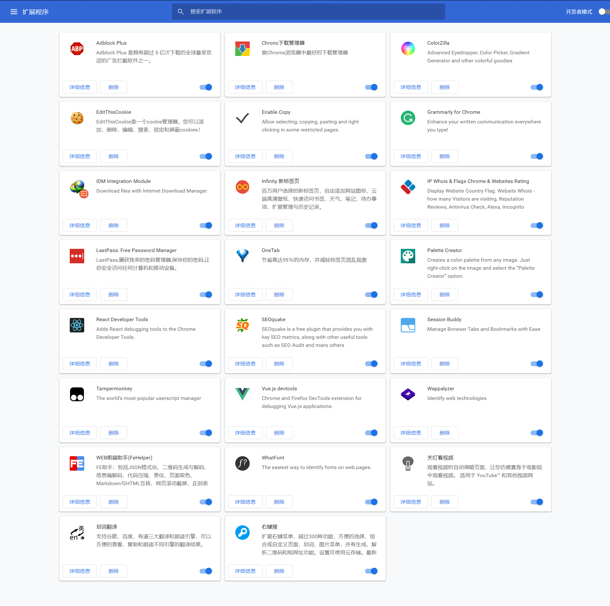

chrome插件是能够大大提高我们使用chrome时的操作和浏览体验的好东西；其实在我的大多数朋友中,除了少部分被我安利过的一些人,很多人甚至都不知道浏览器可以装插件。很多人在使用浏览器器时都有过各种不好的体验:各种形式的广告, 弹窗广告，视频中的广告，某些视频网站甚至是满屏的广告,就连百度的搜索结果也有广告。可能你还会对一些网站的页面排版布局不满意或者审美疲劳了，比如百度贴吧,那么你可以借助插件美化下页面布局。还有看视频要会员，有些页面不能复制，网站每次访问都要重新登入等等；这一切的不愉快。借助chrome插件，大多都能解决；

### 怎样下载chrome插件

下载chrome插件可以访问[chrome插件市场](https://chrome.google.com/webstore/category/extensions),在这个网站你可以通过推荐或者搜索下载各种实用好玩的插件或者主题；ps: 利用好星级选项;

但是有个问题: 没有FQ是没办法访谷歌的绝大部分网站的，包括这个插件市场。想要FQ，常见的有两种方式: 

一种是通过一些免费或者收费的代理软件，就是常说的`VPN`，比如蓝灯,赛风等。

另一种是通过`shadowsocksR`等工具自己搭建代理服务器，网络术语`ssr`。

如果只是下载插件这种小流量的使用，推荐使用蓝灯。github[蓝灯最新版地址](https://github.com/getlantern/lantern);

### 介绍几个常用的

#### Infinity 新标签页

这个插件简直是chrome必装的。`Inifinity`是一个**首页插件**。

你可以将平时常逛的站点添加进来，其实平时常逛的网站就那么几个。使用这个插件看起来简洁舒服，背景大图自带磨砂效果，可以设置每天自动换壁纸。

打开浏览器默认的首页啥也没有，简直无感。而且这个插件做的很有技术水平，给人一种在使用手机桌面的感觉，整体material风格, 用来当首页时十分不错。

#### 划词翻译

作为一个开发者，经常会有取变量名却不知道英文是啥的烦恼。`划词翻译`这是我用过翻译的`准确率`最高的翻译工具了。拿百度翻译做下对比，百度翻译真丢人;

#### WEB前端助手(FeHelper)

前端开发者必备啊! 完美的诠释了`一家更比十家强` ，会自动检测页面内容提示是否格式化源代码。功能非常全面，包括:

1. JSON格式化
2. 二维码生成与解码
3. 信息编解码
4. 代码压缩美化
5. 页面取色
6. Markdown与HTML互转
7. 网页滚动截屏
8. 正则表达式
9. 时间转换工具
10. 编码规范检测
11. 页面性能检测
12. Ajax接口调试
13. 密码生成器
14. JSON比对工具

#### Tampermonkey

又叫油猴，油猴它本身其实并不提供给用户什么功能，它是一个插件管理器，我们可以通过其官方站点推荐的一些插件网站去下载各种`tampermonkey`插件。注意: 这里说的是`tampermonkey`插件，不是`chrome`插件。

tampermonkey的原理是通过读取tampermonkey插件的配置，在用户访问和配置相匹配的网站，浏览器渲染网页的合适时机注入一些js代码。以此达到改变页面布局样式，屏蔽广告，自动登陆，自动查找页面网盘密码并填充，以及将页面vip视频链接替换成解析后的地址等功能。

如果你自己要写一些脚本来对某个网站做样式修改或自动登入等功能的话，可以在该插件自带的编辑器中直接写你的js代码,保存就可以立即生效。

其实tampermonkey插件和chrome插件都可以实现很多扩展功能，并且chrome插件的能获得的对浏览器控制的能力明显是强于tampermokey插件的:

 chrome插件能够使用很多浏览器提供的插件api, 而且权限更大，可以修改菜单栏等等， tampermonkey只能注入js代码。但是为什么很多的优秀脚本是tampermonekey脚本而不是chrome脚本，他们为什么不去做chrome插件而去做油猴插件呢？ 

其实很好解释:  首先tampermonkey插件相当于是跨平台的，只要你使用的浏览器有tampermokey这个插件，你编写的tampermonkey插件可以直接用，不用改代码。比如火狐上也有tampermonkey这个插件，你用在chrome上面的tampermonkey插件可以直接用在火狐上。其次就是chrome应用市场你不一定能访问啊，tampermokey插件网站是不需要FQ的，注册chrome插件开发者要花钱啊，发布chrome插件要审核啊等。

下面放张我使用的tampermonkey插件列表图, 这些插件看名字也知道是干嘛用的，亲测都是有用的哦:

这样的百度贴吧是不是看起来舒服很多呢?

## 还有很多很实用的插件

下面这些也很实用，就直接列举它们的功能了

1. `Adblock Plus`  拦截广告的神器
2. `Chrono下载管理器`  比自带的好用多了
3. `Enable Copy`  解除某些网站文字不能复制的问题
4. `IP Whois & Flags Chrome & Websites Rating`  功能就和名字一样，能够显示当前网站ip地址，具体的地理位置，访问过的人的数量等；图标会自动切换成对于国家的国旗，信息还是挺全的。
5. `Last pass` 方便你管理自己的密码和省去某些网站每次登入都需要密码的烦恼。
6. `One tab` 作者称可以节省95%的浏览器内存；由于chrome浏览器是打开一个标签页一个进程，当打开很多标签页时就会占用很多的内存。这个插件帮你把打开的所有标签页收到一个标签页，减少了打开的标签页也就节省了内存。
7. `Grammarly` 当你在文本框中输入英文单词时，这个插件会提示你哪里的单词有拼写问题，纠正你的书写习惯。
8. `Wappalyzer` 可以通过它查看当前打开的网页站点使用了哪些技术，如编程语言，web框架啊。